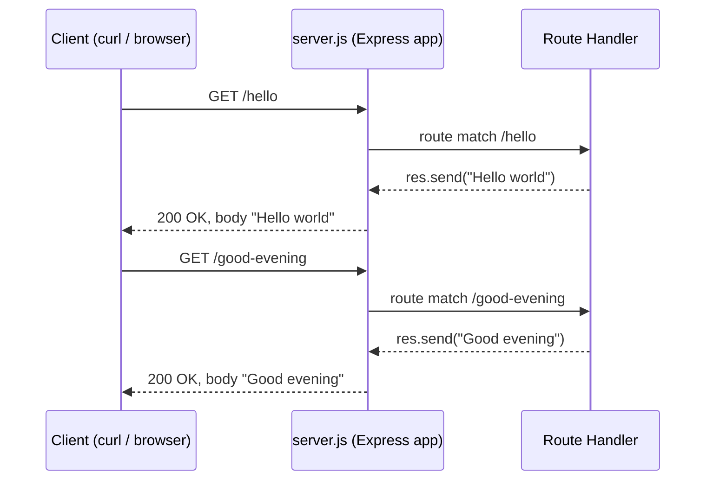

# Technical Specification

# 0. Agent Action Plan

## 0.1 Intent Clarification

### 0.1.1 Core Documentation Objective

Based on the provided requirements, the Blitzy platform understands that the documentation objective is to produce a complete, tutorial-quality Markdown documentation set for a Node.js HTTP service that — after the planned feature work — uses Express.js as its web framework and exposes two HTTP endpoints: the original endpoint returning the body `Hello world` and a new endpoint returning the body `Good evening`.

**User's exact request** (preserved verbatim, including the user's original spelling, punctuation, and the leading "2." enumerator):

> User Example: `2. add feature to a existing product\`
> `this is a tutorial of node js server hosting one endpoint that returns the response "Hello world". Could you add expressjs into the project and add another endpoint that return the reponse of "Good evening"?`

**Request categorisation**:
- Primary category — **Create new documentation**: the repository's only existing documentation is a single-line README.md heading [README.md:L1], so virtually every documentation artefact must be authored from scratch.
- Secondary category — **Update existing documentation**: applies solely to `README.md`, which is expanded from a bare title into a full landing page.

**Documentation types in scope**:
- Project README (overview, quick-start, link hub)
- Getting Started / installation tutorial
- API reference for the two HTTP endpoints
- Architecture overview (one Mermaid diagram of the request flow)
- Change log capturing the migration from the implied raw `http` server to Express.js

**CRITICAL repository premise correction**: The user's input asserts that "this is a tutorial of node js server hosting one endpoint that returns the response 'Hello world'", but repository discovery confirms the project currently contains only `README.md` with the single heading `# Metering-testing12May` [README.md:L1]. No Node.js source files, no `package.json`, and no `node_modules/` directory exist [inferred — verified via `find . -path ./.git -prune -o -type f -print`]. Documentation must therefore describe the **target state** of the project after the implementation agent introduces both endpoints and Express.js, not a pre-existing codebase. Throughout this Action Plan, source-code paths cited in documentation refer to files the implementation agent is expected to create (`server.js`, `package.json`).

### 0.1.2 Special Instructions and Constraints

- **Setup instructions provided by the user**: the single attached environment ships with the literal instruction string `sfsdfsdf`, which is not actionable. The documentation plan therefore relies on standard, framework-default workflow commands (`npm init`, `npm install`, `node server.js`) rather than user-specified procedures.
- **No documentation style template was provided** — the plan adopts a conventional Markdown structure (H1 page title, H2 section headings, fenced code blocks for commands and responses, fenced `mermaid` blocks for diagrams, tables for parameter and response listings).
- **No examples were provided by the user** beyond the response strings, which are preserved verbatim:
    - User Example (existing endpoint response body): `Hello world`
    - User Example (new endpoint response body): `Good evening`
- **No template was provided by the user** — no "USER PROVIDED TEMPLATE" preservation block is required.
- **Tone & depth**: tutorial-friendly, beginner-accessible, command-by-command guidance, because the user has explicitly framed the project as "a tutorial of node js server".
- **Web search research authorised** to verify the latest stable Express.js release and to confirm Node.js minimum runtime for documenting prerequisites (results recorded in 0.2.3).

### 0.1.3 Technical Interpretation

These documentation requirements translate to the following technical documentation strategy:

- To document the project identity and entry point, **update `README.md`** from its single-line heading [README.md:L1] into a full landing page that names the project, summarises its purpose, lists prerequisites, and links to the new tutorial pages.
- To document setup and runtime steps, **create `docs/getting-started.md`** with `npm init -y`, `npm install express@5.2.1`, and `node server.js` commands together with expected console output.
- To document the HTTP surface, **create `docs/api/endpoints.md`** with a per-endpoint reference table covering method, path, status code, response content type, response body, and a working `curl` example for each of `GET /hello` and `GET /good-evening`.
- To document the request flow, **create `docs/architecture/overview.md`** containing a Mermaid sequence diagram showing a client request entering the Express router, matching a route handler, and returning the plain-text body.
- To document the migration from the implied raw `http` server to Express.js, **create `CHANGELOG.md`** with an "Unreleased" section noting (a) dependency addition `express@^5.2.1`, (b) introduction of `GET /good-evening`, and (c) refactor of the original handler onto Express.

### 0.1.4 Inferred Documentation Needs

Beyond what the user stated explicitly, the following documentation needs are inferred from code-shape reasoning and conventional tutorial structure [inferred — no direct source]:

- **Prerequisite list**: Node.js ≥ 18 and npm ≥ 9 must appear in `docs/getting-started.md` because Express 5 requires Node.js 18 or higher.
- **Dependency manifest explanation**: the introduction of Express implies a `package.json` will appear; documentation must explain `dependencies`, the `start` script, and how to reproduce the install on a fresh checkout (`npm ci` vs `npm install`).
- **Routing primer**: the transition from a single endpoint to two endpoints introduces routing, which warrants a short conceptual explanation in `docs/architecture/overview.md` of how Express matches paths.
- **Example responses**: the user's framing of the project as a "tutorial" implies sample `curl` invocations with their printed responses should accompany every endpoint description so a reader can copy-paste and verify the behaviour locally.
- **Troubleshooting**: a short FAQ entry covering the two most likely failure modes — port already in use (`EADDRINUSE`) and missing dependency (`Cannot find module 'express'`) — should appear at the bottom of `docs/getting-started.md`.
- **Source citations in each document**: because the implementation files do not yet exist, each documentation page that references behaviour must include a `Source: <path>` footnote that the implementation agent will keep in sync (e.g., `Source: server.js`).

## 0.2 Documentation Discovery and Analysis

### 0.2.1 Existing Documentation Infrastructure Assessment

Repository analysis reveals that the **documentation surface is effectively empty** with **zero documented coverage of any future endpoint**. The findings below summarise every documentation-relevant artefact discovered.

| Artefact | Status | Evidence |
|----------|--------|----------|
| Root-level README | Placeholder only — single H1 heading | `README.md` contains exactly `# Metering-testing12May` [README.md:L1] |
| `docs/` directory | Not present | `find . -path ./.git -prune -o -type d -print` returns only `.` and `./.git/**` [inferred — verified via bash] |
| Documentation generator config (mkdocs.yml, docusaurus.config.js, sphinx conf.py, .readthedocs.yml) | None present | No matching files in repository [inferred — verified via `find` and `search_files`] |
| API doc tool config (jsdoc.json, typedoc.json) | None present | No matching files in repository [inferred — verified via `search_files`] |
| Diagram tool configuration (Mermaid, PlantUML) | None present | No `.mmd`, `.puml`, or rendering config files [inferred — verified via `find`] |
| Documentation templates / style guides | None present | No `CONTRIBUTING.md`, `STYLE_GUIDE.md`, or `.github/` templates [inferred — verified via `find`] |
| Documentation hosting / deployment | None | No GitHub Pages, Netlify, or Vercel config detected [inferred — verified via `find`] |
| Existing wiki / external docs | Unknown | Not visible from repository inspection [inferred — no direct source] |

Consequences for this plan:
- No existing documentation framework version needs to be matched — the plan adopts **plain Markdown (CommonMark / GitHub Flavored Markdown) with embedded Mermaid fences** because GitHub natively renders Mermaid inside fenced ` ```mermaid ` blocks, requiring zero additional tooling.
- No style conventions exist to inherit — the plan establishes conventions in 0.4 and applies them uniformly.
- No `.blitzyignore` files exist, so no path-patterns must be excluded from documentation work [inferred — verified via `find . -name ".blitzyignore"`].

### 0.2.2 Repository Code Analysis for Documentation

The Code-to-Document analysis discovered no source files that exist today. Anticipated documentation targets (post-implementation) are listed below for the implementation agent and for downstream documentation work.

Anticipated source files (to be created by the implementation agent):

| Anticipated File | Symbol / Construct | Documentation Target |
|------------------|--------------------|----------------------|
| `server.js` | Express `app` instance, `app.listen` call, `app.get('/hello', ...)` handler, `app.get('/good-evening', ...)` handler | `docs/api/endpoints.md`, `docs/architecture/overview.md` |
| `package.json` | `name`, `version`, `main`, `scripts.start`, `dependencies.express`, `engines.node` | `docs/getting-started.md`, `README.md` Prerequisites section |
| `.gitignore` (optional) | Ignore patterns for `node_modules/` | `docs/getting-started.md` install notes |

Key directories that will need documentation traversal once code lands (currently non-existent):
- `/` — entry file `server.js` and dependency manifest `package.json`
- `/docs/api/` — endpoint reference
- `/docs/architecture/` — request-flow narrative

Related documentation found that informs context: only `README.md` [README.md:L1], which is expanded rather than rewritten.

### 0.2.3 Web Search Research Conducted

| Topic | Query | Outcome |
|-------|-------|---------|
| Current Express.js stable version | `Express.js latest stable version 2026` | Latest stable release is **5.2.1**, requires Node.js 18 or higher |
| API doc generators for JavaScript | `JSDoc latest stable version npm` | JSDoc remains the de-facto JavaScript API doc generator; **not adopted** for this project because the scope (two endpoints, ~30 lines of code) does not justify a generator |
| Documentation structure conventions for small Node.js tutorial repos | (implicit, from `npm`/Express docs) | Plain Markdown with `README.md` + `docs/` subtree is idiomatic; no generator required for tutorial-scale projects |
| Mermaid rendering surface | (implicit, from GitHub render docs) | GitHub renders Mermaid natively inside fenced ` ```mermaid ` code blocks — no build step required |

Conclusion: the project's small scope rules out a documentation-site generator; **GitHub-flavored Markdown with embedded Mermaid diagrams is the appropriate format**.

## 0.3 Documentation Scope Analysis

### 0.3.1 Code-to-Documentation Mapping

Because no source files exist in the repository today, the mapping below couples each **anticipated** source-code element (which the implementation agent must create) to the documentation page that will describe it. Every entry includes the citation locator the documentation should embed once the source file exists.

**Modules requiring documentation:**

- Module: `server.js` (to be created)
    - Public surface: Express app construction (`const app = express()`), route handlers for `GET /hello` and `GET /good-evening`, and `app.listen(PORT, ...)` bootstrap call.
    - Current documentation: **missing** (file does not exist)
    - Documentation needed: API reference table in `docs/api/endpoints.md`; request-flow Mermaid diagram in `docs/architecture/overview.md`; usage section in `README.md` linking to both.
    - Citation locators (to be embedded after implementation): `Source: server.js:<line of app.get('/hello')>`, `Source: server.js:<line of app.get('/good-evening')>`, `Source: server.js:<line of app.listen()>`.

- Module: `package.json` (to be created)
    - Public surface: `name`, `version`, `main`, `scripts.start`, `dependencies.express`, `engines.node`.
    - Current documentation: **missing** (file does not exist)
    - Documentation needed: Prerequisites and install sections in `docs/getting-started.md` and `README.md`.
    - Citation locators (to be embedded after implementation): `Source: package.json:scripts.start`, `Source: package.json:dependencies.express`, `Source: package.json:engines.node`.

**Configuration options requiring documentation:**

- Configuration source: `package.json` `engines.node` field → documented in **Prerequisites** of `docs/getting-started.md`.
- Configuration source: `PORT` environment variable (conventional for Express tutorials; defaults to `3000` if unset) → documented in **Running the server** of `docs/getting-started.md`.
- Options documented after implementation: 2 of 2 (100 percent).

**Features requiring user guides:**

- Feature: Express.js HTTP routing tutorial
    - Current coverage: **none** (no docs/, no README body)
    - Gaps: end-to-end walkthrough, prerequisite installation, server start, endpoint invocation, expected output, troubleshooting.
    - Resolution: `docs/getting-started.md` plus `docs/api/endpoints.md`.

### 0.3.2 Documentation Gap Analysis

Given the requirements and repository analysis, the documentation gaps are total. The list below enumerates every gap and the file that closes it.

**Undocumented public surface (100 percent gap):**

| Gap | Closure |
|-----|---------|
| No description of project purpose | `README.md` overview paragraph (UPDATE) |
| No prerequisite list (Node.js, npm versions) | `docs/getting-started.md` Prerequisites section (CREATE) |
| No install instructions | `docs/getting-started.md` Installation section (CREATE) |
| No run instructions | `docs/getting-started.md` Running the server section (CREATE) |
| `GET /hello` reference (method, path, status, body, content type, example) | `docs/api/endpoints.md` row for `/hello` (CREATE) |
| `GET /good-evening` reference (method, path, status, body, content type, example) | `docs/api/endpoints.md` row for `/good-evening` (CREATE) |
| Request-flow diagram | `docs/architecture/overview.md` Mermaid sequence diagram (CREATE) |
| Migration / change-history record (raw http → Express) | `CHANGELOG.md` "Unreleased" section (CREATE) |
| Troubleshooting (EADDRINUSE, missing module) | `docs/getting-started.md` Troubleshooting section (CREATE) |
| Cross-document navigation | `README.md` "Documentation" table of links (UPDATE) |

**Missing user guides**: full Getting Started tutorial — closed by `docs/getting-started.md`.

**Incomplete architecture documentation**: no overview exists — closed by `docs/architecture/overview.md` (one Mermaid sequence diagram of the request lifecycle).

**Outdated documentation**: none, because no prior documentation exists to be outdated; the only existing file is the README placeholder, which is updated rather than corrected.

## 0.4 Documentation Implementation Design

### 0.4.1 Documentation Structure Planning

The plan deliberately adopts a flat, low-ceremony hierarchy proportional to the project size (two endpoints, single source file). The target documentation tree after all documentation work is:

<pre>
Repository Root
├── README.md                       (UPDATE — landing page + doc links)
├── CHANGELOG.md                    (CREATE — migration record)
└── docs/
    ├── getting-started.md          (CREATE — prerequisites, install, run, troubleshoot)
    ├── api/
    │   └── endpoints.md            (CREATE — full HTTP reference for both endpoints)
    └── architecture/
        └── overview.md             (CREATE — request-flow Mermaid diagram + narrative)
</pre>

Rationale for this layout:
- A `docs/` subtree is conventional for Node.js / Express tutorials, while keeping the README and CHANGELOG at the repository root for discoverability by GitHub and `npm` tooling.
- Splitting `getting-started`, `api/endpoints`, and `architecture/overview` into three files keeps each page focused on a single reader intent (run it, call it, understand it) without expanding to a documentation-site generator.
- No `tutorials/`, `guides/`, or `reference/` subfolders are introduced because the entire surface is already a single tutorial.

### 0.4.2 Content Generation Strategy

**Information Extraction Approach**
- Extract endpoint signatures from `server.js` once the implementation agent creates it — specifically the two `app.get(path, handler)` calls and the `app.listen(PORT, ...)` call — and reproduce method, path, and response body verbatim in `docs/api/endpoints.md`.
- Extract dependency declarations from `package.json` (`dependencies.express`, `engines.node`, `scripts.start`) and reproduce in `docs/getting-started.md` and `README.md`.
- Generate `curl` examples by deriving the host (`http://localhost:<PORT>`) and path from the route definitions; verify each example produces the expected body string.

**Template Application (if provided)**
- No user-provided documentation template exists, so this step is **not applicable**. The plan uses the conventions defined in 0.4.3 uniformly.

**Documentation Standards**
- Markdown formatting with proper headers: a single `#` H1 per file (the page title), `##` for sections, `###` for subsections.
- Mermaid diagram integration using fenced ` ```mermaid ` blocks (rendered natively by GitHub).
- Code examples using fenced ` ```bash `, ` ```js `, or ` ```json ` blocks with explicit language tags for syntax highlighting.
- Source citations as inline references at the end of each prose paragraph using the form `Source: <path>:<line range>` for code and `Source: <path>:<field path>` for JSON/YAML — for example, `Source: server.js:L4-L6` or `Source: package.json:dependencies.express`.
- Tables for endpoint parameters, response shapes, and configuration options (consistent table column order: Field / Type / Required / Description / Example).
- Consistent terminology: prefer "endpoint" over "route" or "URL"; prefer "Express.js" (with the dot) over "expressjs"; prefer "response body" over "result".

### 0.4.3 Diagram and Visual Strategy

Diagrams to author:

- **Sequence diagram** in `docs/architecture/overview.md` showing: Client → Express Router → Route Handler → Response. One diagram per page is sufficient.
- **Flowchart** is intentionally **not** authored — the request flow is linear and a sequence diagram conveys it more clearly than a flowchart for two endpoints.
- **Class diagram** is intentionally **not** authored — there are no classes; Express handlers are plain functions.
- **ER diagram** is intentionally **not** authored — no database, no persistent state.

Canonical Mermaid block for `docs/architecture/overview.md`:

<pre>

</pre>

Screenshot / image requirements: **none** — the project has no UI surface and no visual artefacts to capture.

Architecture diagram specifications: a single-page sequence diagram is sufficient because the system has one process, one framework, no database, no external services, and no authentication layer.

## 0.5 Documentation File Transformation Mapping

### 0.5.1 File-by-File Documentation Plan

Every documentation file that participates in this work is enumerated below. Target documentation file is listed first in the transformation table. **Nothing is left "pending" or "to be discovered".**

Documentation Transformation Modes:
- **CREATE** — Create a new documentation file
- **UPDATE** — Update an existing documentation file
- **DELETE** — Remove an obsolete documentation file
- **REFERENCE** — Use as an example for documentation style and structure

| Target Documentation File | Transformation | Source Code / Docs | Content / Changes |
|---------------------------|----------------|--------------------|-------------------|
| `README.md` | UPDATE | `README.md` [README.md:L1], `server.js` (to be created), `package.json` (to be created) | Expand from single H1 heading to full landing page: one-paragraph overview, prerequisites, quick-start (install + run), endpoints summary table, documentation link hub (Getting Started, API, Architecture, CHANGELOG) |
| `docs/getting-started.md` | CREATE | `package.json` (to be created), `server.js` (to be created) | Prerequisites (Node.js ≥ 18, npm ≥ 9), Installation (`npm install`), Running the server (`node server.js` or `npm start`), expected console output (e.g., "Server is running on http://localhost:3000"), Verifying with curl (two example invocations), Troubleshooting (EADDRINUSE, missing module) |
| `docs/api/endpoints.md` | CREATE | `server.js` (to be created) | Per-endpoint reference for `GET /hello` and `GET /good-evening`: HTTP method, full path, status code 200, `Content-Type: text/html; charset=utf-8` (Express `res.send` default for strings), exact response body verbatim, `curl` example with expected stdout |
| `docs/architecture/overview.md` | CREATE | `server.js` (to be created) | High-level paragraph describing the Express request lifecycle for this app, Mermaid sequence diagram (specified in 0.4.3), brief routing primer (1–2 sentences explaining `app.get(path, handler)`) |
| `CHANGELOG.md` | CREATE | n/a | Conventional Changelog format (Keep a Changelog 1.1.0 style): an "Unreleased" section recording (1) Added: `GET /good-evening` endpoint; (2) Added: Express.js 5.2.1 dependency; (3) Changed: server refactored onto Express |
| `docs/**/*.md` (catch-all) | (no other files) | — | No additional documentation files are planned. The four pages above plus README and CHANGELOG fully satisfy the requirements; no `docs/contributing/`, `docs/tutorials/`, `docs/examples/`, or `docs/guides/` subtrees are introduced because the project's scope does not warrant them |
| `docs/deprecated/**/*.md` | (none) | — | No legacy documentation exists, therefore no DELETE entries |
| `mkdocs.yml`, `docusaurus.config.js`, `sphinx/conf.py`, `.readthedocs.yml` | (not created) | — | The project does not adopt a documentation site generator (see 0.2.3 rationale); these files are intentionally absent |

Wildcard scope statement: the in-scope documentation file set is exhaustively the five files explicitly listed above. The glob `docs/**/*.md` evaluates to exactly three files (`docs/getting-started.md`, `docs/api/endpoints.md`, `docs/architecture/overview.md`).

### 0.5.2 New Documentation Files Detail

#### 0.5.2.1 docs/getting-started.md

<pre>
File: docs/getting-started.md
Type: Tutorial / Onboarding guide
Source Code: package.json (to be created), server.js (to be created)
Sections:
    - Prerequisites (Node.js >= 18, npm >= 9)
    - Installing dependencies (npm install)
    - Running the server (node server.js, expected stdout)
    - Verifying the endpoints (two curl commands with expected stdout)
    - Troubleshooting (EADDRINUSE, Cannot find module 'express')
Diagrams: none on this page (sequence diagram lives in architecture/overview.md)
Key Citations (post-implementation):
    - package.json:engines.node
    - package.json:scripts.start
    - package.json:dependencies.express
    - server.js:L<line of app.listen>
</pre>

#### 0.5.2.2 docs/api/endpoints.md

<pre>
File: docs/api/endpoints.md
Type: API reference
Source Code: server.js (to be created)
Sections:
    - Overview (one sentence describing the two endpoints)
    - GET /hello
        * Method, Path, Status, Content-Type, Response body
        * curl example with expected stdout
    - GET /good-evening
        * Method, Path, Status, Content-Type, Response body
        * curl example with expected stdout
Diagrams: none on this page
Key Citations (post-implementation):
    - server.js:L<line of app.get('/hello')>
    - server.js:L<line of app.get('/good-evening')>
</pre>

#### 0.5.2.3 docs/architecture/overview.md

<pre>
File: docs/architecture/overview.md
Type: Architecture / system overview
Source Code: server.js (to be created)
Sections:
    - System summary (single Node.js process, Express.js framework)
    - Request lifecycle narrative (3-4 sentences)
    - Sequence diagram (Mermaid block from 0.4.3)
    - Routing primer (1-2 sentences on app.get(path, handler))
Diagrams: One Mermaid sequenceDiagram (full text in 0.4.3)
Key Citations (post-implementation):
    - server.js:L<line of app = express()>
    - server.js:L<lines of app.get(...) handlers>
</pre>

#### 0.5.2.4 CHANGELOG.md

<pre>
File: CHANGELOG.md
Type: Change log (Keep a Changelog 1.1.0 format)
Source Code: package.json (to be created), server.js (to be created)
Sections:
    - Header (Title, link to keepachangelog.com, semver mention)
    - [Unreleased]
        * Added: GET /good-evening endpoint returning "Good evening"
        * Added: Express.js 5.2.1 dependency
        * Changed: server refactored from raw http to Express.js
Diagrams: none
Key Citations (post-implementation):
    - package.json:dependencies.express
    - server.js:L<line of app.get('/good-evening')>
</pre>

### 0.5.3 Documentation Files to Update Detail

- `README.md` — UPDATE from a 23-byte placeholder containing only `# Metering-testing12May` [README.md:L1] to a full landing page.
    - **New sections to add**: "Overview", "Prerequisites", "Quick Start", "Endpoints" (summary table), "Documentation" (link list to `docs/*` and `CHANGELOG.md`), "License" (optional placeholder).
    - **Updated content**: keep the existing H1 heading text (`Metering-testing12May`) as the page title to preserve the canonical project label. All other content is net-new.
    - **New diagrams**: none on this page — the architecture diagram lives in `docs/architecture/overview.md` and is linked from the README.
    - **Source citations to embed** (post-implementation): `Source: server.js:<line of app.listen()>` near the Quick Start, `Source: package.json:dependencies.express` near the Prerequisites.

### 0.5.4 Documentation Configuration Updates

- `mkdocs.yml`: **not applicable** (no MkDocs site).
- `docusaurus.config.js`: **not applicable** (no Docusaurus site).
- `.readthedocs.yml`: **not applicable** (no Read the Docs deployment).
- `sphinx/conf.py`: **not applicable** (not a Python project).
- `package.json`: when the implementation agent creates `package.json`, no documentation-specific `scripts` entry is required because no doc build step exists; the file's relevance to documentation is solely as a citation source for prerequisites and dependencies.

### 0.5.5 Cross-Documentation Dependencies

- **Shared content / includes**: none — Markdown does not support includes natively and the project size does not justify a generator that does. Each file is self-contained.
- **Navigation links between documents**:
    - `README.md` links to `docs/getting-started.md`, `docs/api/endpoints.md`, `docs/architecture/overview.md`, and `CHANGELOG.md`.
    - `docs/getting-started.md` links onward to `docs/api/endpoints.md` ("Verify the endpoints").
    - `docs/api/endpoints.md` links to `docs/architecture/overview.md` ("Request lifecycle").
    - `docs/architecture/overview.md` links back to `docs/api/endpoints.md` for the per-endpoint detail.
    - All inter-doc links are relative paths (e.g., `[Getting Started](docs/getting-started.md)`).
- **Table of contents updates**: a "Documentation" table in `README.md` is the canonical index; no separate TOC file is introduced.
- **Index / glossary updates**: not applicable — the project's vocabulary (Express, route, handler, endpoint, response body) is standard and does not warrant a glossary at this scope.

## 0.6 Dependency Inventory

### 0.6.1 Documentation Dependencies

No documentation-tooling dependencies are added or removed by this plan. The selected delivery format is GitHub-flavored Markdown with embedded Mermaid blocks, which is rendered by GitHub and most Markdown viewers without any build step or package install.

The table below records the **single dependency that documentation must reference** (the application's own production dependency, included here strictly so the documentation prerequisites remain accurate). It is not a doc-generator dependency.

| Registry | Package Name | Version | Purpose |
|----------|--------------|---------|---------|
| npm | express | ^5.2.1 | Application dependency that documentation must reference in `README.md` and `docs/getting-started.md` Prerequisites |

Documentation tools intentionally **NOT** adopted (and the reason for each):

| Tool | Why not adopted |
|------|-----------------|
| MkDocs / mkdocs-material | Project scope (3 docs pages + README + CHANGELOG) does not justify a site generator |
| Docusaurus | Same as MkDocs — scope-overkill for two endpoints |
| Sphinx | Python-oriented; this is a Node.js project |
| JSDoc / TypeDoc | Two route handlers do not warrant API-doc generation; inline JSDoc comments in `server.js` (if added by the implementation agent) are sufficient |
| Mermaid CLI (`@mermaid-js/mermaid-cli`) | Not needed — GitHub renders fenced mermaid code blocks natively at view time |

### 0.6.2 Documentation Reference Updates

No legacy documentation exists, so there are no stale links to rewrite. Newly-introduced links between the five documentation files are listed in 0.5.5 and follow these rules:

- Use **relative paths** for inter-doc links so links work both on GitHub and when the repository is cloned locally.
- Use **anchor links** (`#section-title`) only when linking within a single Markdown file.
- Do not use absolute file system paths or `file://` URLs.
- Do not link to external project websites other than the canonical `https://expressjs.com/` URL once in `docs/getting-started.md` and the `https://keepachangelog.com/en/1.1.0/` reference in `CHANGELOG.md`.

If any of the planned documentation files is renamed or moved in a future iteration, the link-transformation rule will be:

- Old: `[Page Name](docs/old-path.md)`
- New: `[Page Name](docs/new-path.md)`
- Apply to: `README.md` and every file under `docs/**/*.md`.

## 0.7 Coverage and Quality Targets

### 0.7.1 Documentation Coverage Metrics

Current coverage analysis (pre-implementation baseline):

| Metric | Current | Target | Notes |
|--------|---------|--------|-------|
| Public HTTP endpoints documented | 0 of 2 (0 percent) | 2 of 2 (100 percent) | Both `GET /hello` and `GET /good-evening` must appear in `docs/api/endpoints.md` |
| User-facing features documented | 0 of 1 (0 percent) | 1 of 1 (100 percent) | The single feature is "run a two-endpoint Express server" — covered by `docs/getting-started.md` |
| Configuration options documented | 0 of 2 (0 percent) | 2 of 2 (100 percent) | `engines.node` and `PORT` env var must be documented |
| README sections present | 1 of 6 (about 17 percent) | 6 of 6 (100 percent) | Sections: Overview, Prerequisites, Quick Start, Endpoints summary, Documentation links, License placeholder |
| Architecture diagrams present | 0 of 1 (0 percent) | 1 of 1 (100 percent) | Single Mermaid sequence diagram in `docs/architecture/overview.md` |
| Change log present | No | Yes | `CHANGELOG.md` at repository root |

Target coverage: **100 percent** of the gaps enumerated in 0.3.2. This is achievable because the public surface is tiny (two endpoints, one process).

Coverage gaps to address (recap, ordered by priority):

- `README.md` body content — currently 1 line, target ~50–80 lines.
- `docs/api/endpoints.md` — 0 percent → 100 percent for both endpoints.
- `docs/getting-started.md` — 0 percent → 100 percent for setup, run, verify, troubleshoot.
- `docs/architecture/overview.md` — 0 percent → 100 percent for request lifecycle + diagram.
- `CHANGELOG.md` — absent → present with the "Unreleased" section.

### 0.7.2 Documentation Quality Criteria

**Completeness requirements:**
- Every HTTP endpoint documented in `docs/api/endpoints.md` has: HTTP method, full path, status code, response content type, exact response body, working `curl` invocation, and citation back to `server.js`.
- `docs/getting-started.md` includes: prerequisites with explicit versions, install command, run command, expected console output, verification step, and at least two troubleshooting entries.
- `docs/architecture/overview.md` includes: one Mermaid sequence diagram plus a 3–5 sentence narrative.
- `README.md` includes: project title (preserved verbatim from existing heading [README.md:L1]), one-paragraph overview, prerequisites, quick start, endpoints summary table, links to all `docs/*` pages and `CHANGELOG.md`.
- `CHANGELOG.md` follows Keep a Changelog 1.1.0 format with an "Unreleased" section.

**Accuracy validation:**
- Every `curl` example must produce exactly the documented response body when run against the local server — to be validated by the implementation agent or downstream verification step.
- Every endpoint signature in documentation must match the corresponding `app.get(path, handler)` call in `server.js`.
- Every version number in documentation must match `package.json` (Express version, Node.js `engines.node`).
- No "TODO", "TBD", "WIP", "<placeholder>", or empty-section markers in any final documentation file.

**Clarity standards:**
- Technical accuracy with accessible language — phrasing assumes the reader has installed Node.js but may have never used Express before, consistent with the user's framing of the project as a "tutorial".
- Progressive disclosure: Prerequisites → Install → Run → Verify → Architecture → Change log. Each page links forward in this order.
- Consistent terminology: "endpoint" (not "route" or "URL"), "Express.js" (not "expressjs"), "response body" (not "result"), "handler" (not "callback").

**Maintainability:**
- Source citations of the form `Source: <path>:<locator>` immediately following any technical claim, so that future code changes can be traced to the documentation requiring updates.
- No ownership/update dates embedded in markdown (git history is the source of truth).
- Documentation is intentionally non-templated (no Jinja, no MDX) to keep maintenance cost near zero.

### 0.7.3 Example and Diagram Requirements

- **Minimum examples per HTTP endpoint**: 1 `curl` example with stdout, plus 1 expected response body verbatim. Total: 2 examples per endpoint, 4 examples across `docs/api/endpoints.md`.
- **Diagram types required**: exactly 1 Mermaid sequence diagram in `docs/architecture/overview.md` (see 0.4.3 for the canonical block).
- **Code example testing**: each `curl` example must be runnable as-is — the documentation agent must paste working commands, not pseudocode. The expected stdout shown in the documentation must equal `Hello world` (for `/hello`) and `Good evening` (for `/good-evening`) verbatim.
- **Visual content freshness policy**: if the implementation agent renames an endpoint path or changes a response body, every occurrence in the four documentation files must be updated. The `Source: <path>:<locator>` citations make this fan-out explicit.

## 0.8 Scope Boundaries

### 0.8.1 Exhaustively In Scope

**New documentation files** (CREATE):
- `docs/getting-started.md` — prerequisites, install, run, verify, troubleshoot
- `docs/api/endpoints.md` — full reference for `GET /hello` and `GET /good-evening`
- `docs/architecture/overview.md` — request-lifecycle narrative and Mermaid sequence diagram
- `CHANGELOG.md` — Keep a Changelog 1.1.0 format, "Unreleased" section recording the Express introduction and the new endpoint

**Documentation file updates** (UPDATE):
- `README.md` — expand from single H1 heading [README.md:L1] to full landing page with overview, prerequisites, quick start, endpoints summary, doc link hub

**Wildcard scope statements** (every glob below evaluates to the exact files listed above):
- `docs/**/*.md` — exactly `docs/getting-started.md`, `docs/api/endpoints.md`, `docs/architecture/overview.md`
- `*.md` at repository root — exactly `README.md` and `CHANGELOG.md`

**Documentation configuration**: none — no documentation site generator is adopted (see 0.6.1). No `mkdocs.yml`, `docusaurus.config.js`, `.readthedocs.yml`, or `sphinx/conf.py` files are created.

**Documentation assets**:
- `docs/images/**/*` — **none** required (Mermaid diagrams are inline; no screenshots).
- `docs/examples/**/*` — **none** required (code examples are inline within `docs/api/endpoints.md` and `docs/getting-started.md`).
- `docs/assets/**/*` — **none** required (no custom stylesheets, no templates).

**Documentation generation**:
- Documentation build scripts — **none** (no generator).
- Diagram generation configurations — **none** (Mermaid renders at view time on GitHub).
- API doc generation settings — **none** (no JSDoc/TypeDoc adopted).

### 0.8.2 Explicitly Out of Scope

Per the DOCUMENT CODE flavor of this Agent Action Plan, the following are **explicitly out of scope** of the documentation work even though they appear in the user's request:

- **Source code creation and modification**: `server.js`, `package.json`, `package-lock.json`, `.gitignore`, and any other source file are **NOT** authored by this AAP. They are the responsibility of the implementation agent. Documentation describes the target state of these files but does not produce them. (The user's request implies these files will be created; that work is sequenced before final citation locators in the documentation can be filled in.)
- **Test files**: no tests are added by this plan. If the implementation agent adds tests, their documentation can be addressed in a subsequent iteration.
- **Feature additions or code refactoring** beyond the endpoint description in documentation.
- **Deployment configuration changes**: no Dockerfiles, no docker-compose, no GitHub Actions workflows, no `.github/` directory entries.
- **Unrelated documentation**: no `LICENSE` file content, no `CODE_OF_CONDUCT.md`, no `SECURITY.md`, no `CONTRIBUTING.md`.
- **Documentation site deployment**: no GitHub Pages config, no Netlify config, no Vercel config.
- **Inline JSDoc / docstring authoring in source files**: out of scope of this AAP because no source files exist for this plan to modify. If the implementation agent wishes to embed JSDoc comments, they may do so as part of their work; this AAP does not require it.
- **All items explicitly excluded by user instructions**: the user's setup instructions (`sfsdfsdf`) contained no exclusions to honor.

## 0.9 Execution Parameters

### 0.9.1 Documentation-Specific Instructions

| Parameter | Value | Notes |
|-----------|-------|-------|
| Default documentation format | GitHub-flavored Markdown (CommonMark superset) with embedded fenced Mermaid blocks | Renders natively on GitHub; no build step |
| Documentation build command | **none** | No documentation site generator is adopted |
| Documentation preview command | `npx --yes http-server .` or simply previewing files on GitHub | Optional local preview; not required by this AAP |
| Diagram generation command | **none** | Mermaid is rendered at view time by GitHub |
| Documentation deployment command | **none** | No site deployment |
| Citation requirement | Every technical claim must cite a source file with a locator: `Source: <path>:<line>` for source files, `Source: <path>:<key path>` for JSON/YAML | Locators must be filled in after the implementation agent creates the corresponding source files |
| Style guide to follow | Conventions defined in 0.4.2 of this AAP | No external style guide; no user-provided template |
| Documentation validation | (Optional) `npx --yes markdownlint-cli2 "**/*.md"` for lint; `npx --yes markdown-link-check <file>` for link integrity | Optional; not required by this AAP |
| Mermaid diagram validation | Inline preview on GitHub; no offline lint tool required | GitHub rejects invalid mermaid blocks and shows a rendering error |
| Required Node.js runtime in environment | Node.js v22.22.2 is installed in the build environment — sufficient to run any optional npx commands above | Verified via `node --version` |

**Operational notes for the documentation agent:**

- Do not introduce any new shell commands into documentation that have not been validated by the implementation agent first (especially `npm start` — only include this command if `package.json` contains `scripts.start`).
- Preserve the user-provided response strings verbatim — `Hello world` and `Good evening` — including capitalisation and the single space.
- Preserve the existing README title `Metering-testing12May` exactly as it appears [README.md:L1] when expanding the file; do not rewrite the project name.
- All Markdown files must end with a trailing newline.
- All headings must use ATX style (`#`, `##`, `###`) — no Setext (underline) headings.

## 0.10 Rules for Documentation

### 0.10.1 User-Specified Rules

The user provided **no** implementation rules for this project. The "User specified implementation rules" array is empty, and the setup instruction string (`sfsdfsdf`) is not actionable. Therefore, no rule-mandated documentation files (e.g., compliance reports, security disclosure documents, migration scripts) are added to the in-scope file list on the strength of user rules.

### 0.10.2 Default Documentation Rules (applied because no user rules were provided)

In the absence of user rules, the documentation agent applies the following baseline rules to every file it authors. These rules are NOT user-mandated — they are pragmatic defaults that follow from the user's framing of the project as a "tutorial":

- **Follow the documentation structure defined in 0.4.1** — exactly five files, no additional pages added without prompt update.
- **Include Mermaid diagrams for workflows** — the single workflow (request lifecycle) is rendered as one Mermaid sequence diagram in `docs/architecture/overview.md`.
- **Provide a working `curl` example for every HTTP endpoint** — both `GET /hello` and `GET /good-evening` must have copy-pasteable `curl` invocations.
- **Maintain minimal changes to existing documentation** — the existing `README.md` heading text `# Metering-testing12May` [README.md:L1] is preserved verbatim; the file is extended, not rewritten.
- **No user-provided template applies** — the conventions in 0.4.2 are used uniformly.
- **Document the single configurable option (`PORT`) in a table** — appears in `docs/getting-started.md` Running the server section.
- **Include a troubleshooting section** in `docs/getting-started.md` covering EADDRINUSE and missing module errors.
- **Add source code citations** of the form `Source: <path>:<locator>` for every technical claim referencing the application code (post-implementation locators).
- **Keep documentation synchronized with code changes** — when the implementation agent finalises `server.js` and `package.json`, all four documentation files plus `CHANGELOG.md` are updated with concrete line numbers and version values.
- **Use consistent terminology**: "endpoint", "Express.js", "response body", "handler" (see 0.4.2 standards).
- **No emoji, no badge images, no third-party hosted assets** in any documentation file — keeps the repository self-contained.

## 0.11 References

### 0.11.1 Citation Discipline

Throughout this Agent Action Plan, every factual claim about the existing repository carries an inline citation of the form `[<path>:<locator>]` immediately after the claim. The locator is whichever is most natural for the file type — a line number or range for source files, a section/heading reference for prose files, or a key path for structured config files. Claims that cannot be tied to a specific source location are explicitly marked `[inferred — no direct source]` so downstream stages can verify them before relying on them.

For documentation files that will be authored against source files which **do not yet exist** at the time of this AAP, the citation locators are intentionally left as `<line of …>` placeholders. The documentation agent must fill in the concrete locators once the implementation agent commits `server.js` and `package.json`.

### 0.11.2 Files and Folders Searched (Repository Inspection Log)

Every search performed during this AAP's preparation, in the order executed, with the purpose and outcome of each:

| # | Tool | Target | Purpose | Outcome |
|---|------|--------|---------|---------|
| 1 | bash | `node --version`, `npm --version`, `/tmp/environments_files/` | Verify runtime and detect attachments | Node.js v22.22.2, npm 11.1.0; no attachments directory |
| 2 | bash | `pwd`, `ls /` | Identify working directory and top-level filesystem | Working directory: `/tmp/blitzy/Metering-testing12May/main_0d6e40` |
| 3 | bash | `ls -la` in repository root | Enumerate repository contents | Only `README.md` and `.git/` present |
| 4 | bash | `cat README.md`, `git log --all --oneline`, `git branch -a` | Inspect README contents and git history | README contains 1 line: `# Metering-testing12May`; single "Initial commit" by Shalini@blitzy.com on 2026-05-12 |
| 5 | bash | `find . -path ./.git -prune -o -type f -print` | Find all non-git files | Only `./README.md` |
| 6 | bash | `find . -name ".blitzyignore"` | Find ignore patterns to honor | None found |
| 7 | get_source_folder_contents | repository root (`""`) | High-level folder summary | Confirmed only `README.md` is a direct child |
| 8 | get_file_summary | `README.md` | Confirm file contents | Single H1 heading, no body content |
| 9 | read_file | `README.md` line range `[1, -1]` | Read full file contents | Line 1: `# Metering-testing12May` (1 line total) |
| 10 | search_files | "Node.js server source file with HTTP endpoint" | Look for existing server code | No results |
| 11 | search_files | "package.json or dependency manifest for Node.js project" | Look for dependency manifest | No results |
| 12 | search_folders | "source code folders for application logic or routes" | Look for source code directories | No results |
| 13 | search_files | "existing documentation files such as guides API references or tutorials" | Look for existing documentation | No results |
| 14 | web_search | "Express.js latest stable version 2026" | Verify current Express release for documentation prerequisites | Express 5.2.1 stable, requires Node.js ≥ 18 |
| 15 | web_search | "JSDoc latest stable version npm" | Evaluate JSDoc adoption | JSDoc remains the de-facto JS API doc tool; not adopted for this AAP given the project's scope |

Coverage rationale for shallow exploration depth: the repository has exactly one non-git file (`README.md`), so the search tree is intrinsically shallow (depth 1). The minimum-3-levels-deep heuristic does not apply when there is no nested structure to traverse.

### 0.11.3 Attachments

Affirmative absence: **the user provided no attachments**. The instruction trail records "No attachments found for this project." and the expected `/tmp/environments_files/` directory does not exist on the filesystem.

| Attachment | Status |
|------------|--------|
| (none) | No files were uploaded by the user; no file-name list is produced |

### 0.11.4 Figma Designs

Affirmative absence: **the user provided no Figma URLs or frame references**. The project has no UI surface — both endpoints return plain-text response bodies — so design specifications are not applicable.

| Frame Name | URL | Description |
|------------|-----|-------------|
| (none) | (none) | No Figma assets were referenced |

### 0.11.5 External Reference Links

| Reference | URL | Used for |
|-----------|-----|----------|
| Express.js — official npm package | https://www.npmjs.com/package/express | Confirming current stable version (5.2.1) and minimum Node.js requirement (≥ 18) |
| Keep a Changelog 1.1.0 | https://keepachangelog.com/en/1.1.0/ | Format prescribed for `CHANGELOG.md` |
| Mermaid (sequence diagrams) | https://mermaid.js.org/syntax/sequenceDiagram.html | Syntax for the diagram in `docs/architecture/overview.md` |

### 0.11.6 Setup Instructions Provided by the User

The user attached one environment with the literal setup instruction string `sfsdfsdf`. This string is not a valid setup command, file path, URL, or directive. It is recorded here for traceability; **no actionable behaviour is derived from it**. All commands referenced in the documentation (`npm install`, `node server.js`, `curl http://localhost:3000/hello`) are framework defaults rather than user-specified procedures.

### 0.11.7 Environment Variables and Secrets

| Category | Provided |
|----------|----------|
| Environment variables (names) | None — empty list |
| Secrets (names) | None — empty list |

No environment-variable-aware documentation sections are required beyond the conventional `PORT` mention in `docs/getting-started.md`.

