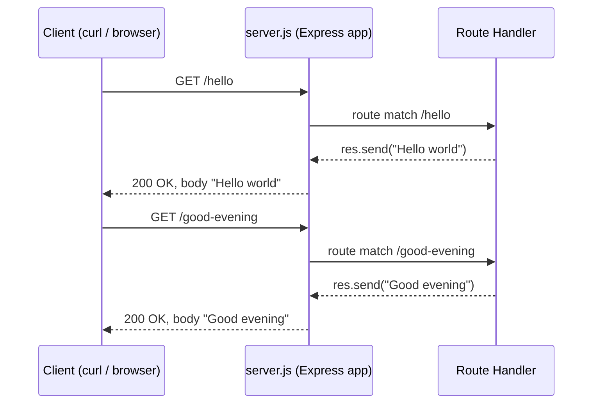

# Architecture Overview

## System Summary

The service is a single Node.js process running an Express.js HTTP server. It has no database, no external services, no authentication layer, and no session state. The service handles two HTTP GET endpoints and returns synchronous plain-text response bodies.

_Source: server.js:<line of app = express()>_

## Request Lifecycle

A client — typically `curl` or a web browser — sends an HTTP GET request to the server's listening port. The underlying Node.js HTTP server hands the request to the Express.js application instance, which delegates routing to the internal Express.js router. The router matches the request path against the endpoints registered via `app.get(path, handler)` and invokes the corresponding handler function. The handler writes the response body with `res.send(string)`, and Express.js returns a `200 OK` response with `Content-Type: text/html; charset=utf-8` and the plain-text body back to the client.

## Sequence Diagram

The diagram below traces both endpoint invocations through the request lifecycle described above.

## Routing Primer

The Express.js `app.get(path, handler)` method registers a handler function to run when an HTTP GET request's path matches `path`. The handler receives two arguments — `req` (the parsed HTTP request) and `res` (the response builder) — and produces the response body by calling `res.send(string)`.

_Source: server.js:<lines of app.get(...) handlers>_

See the [API Reference](../api/endpoints.md) for per-endpoint details (method, path, status, content-type, response body, and `curl` examples).
